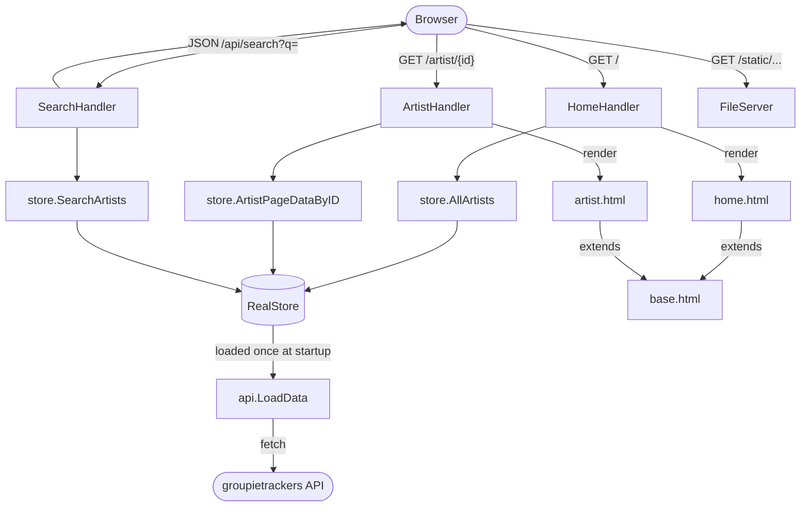
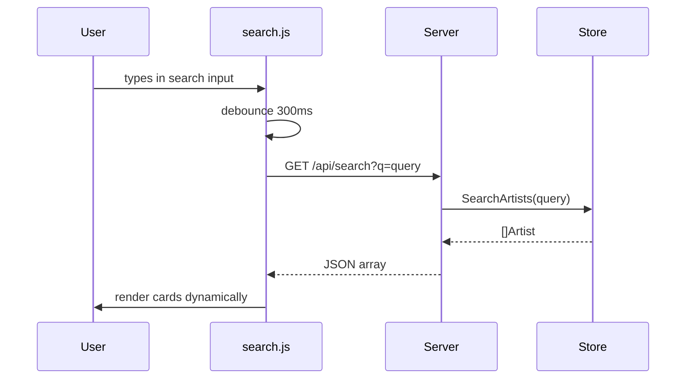

# Diagrams

## Application Flow

```mermaid
flowchart TD
    A([Browser]) -->|GET /| B[HomeHandler]
    A -->|"GET /artist/{id}"| C[ArtistHandler]
    A -->|"GET /api/search?q="| D[SearchHandler]
    A -->|"GET /static/..."| E[FileServer]

    B --> F[store.AllArtists]
    C --> G[store.ArtistPageDataByID]
    D --> H[store.SearchArtists]

    F --> I[(RealStore)]
    G --> I
    H --> I

    I -->|loaded once at startup| J[api.LoadData]
    J -->|fetch| K([groupietrackers API])

    B -->|render| L[home.html]
    C -->|render| M[artist.html]
    D -->|JSON| A

    L -->|extends| N[base.html]
    M -->|extends| N
```

## Request Lifecycle — Live Search

```mermaid
sequenceDiagram
    participant U as User
    participant JS as search.js
    participant S as Server
    participant ST as Store

    U->>JS: types in search input
    JS->>JS: debounce 300ms
    JS->>S: GET /api/search?q=query
    S->>ST: SearchArtists(query)
    ST-->>S: []Artist
    S-->>JS: JSON array
    JS->>U: render cards dynamically
```
